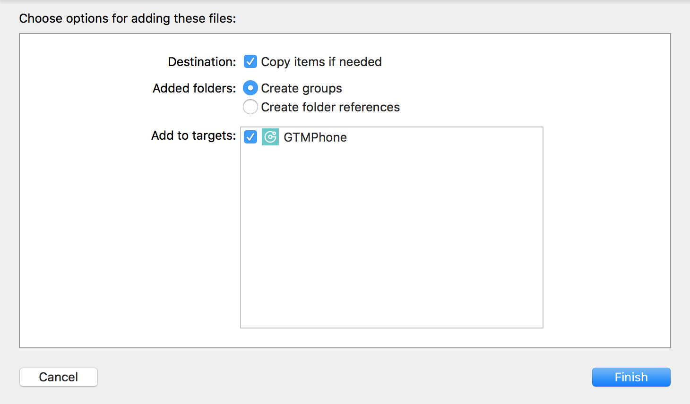
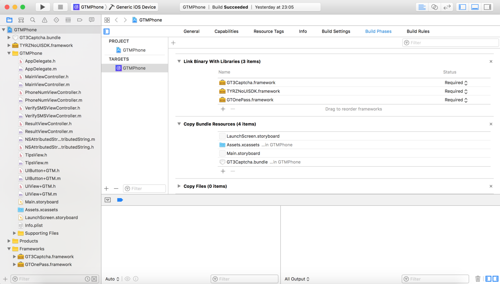
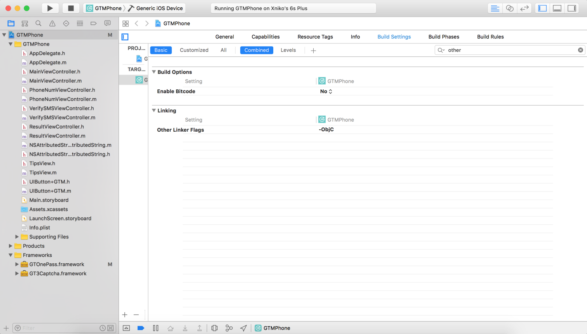

# GTOnePass iOS SDK

了解产品: [www.geetest.com](http://www.geetest.com)

需要拖入仓库`SDK`路径下的`GTOnePass.framework`, `TYRENoUISDK.framework` 2个文件

# 概述及资源

## 环境需求

条目	|资源 			
------	|------------	
开发目标|兼容 iOS7, 推荐 iOS8+		
开发环境|Xcode 8.0	
系统依赖|无
SDK 三方依赖|无		

## 相关开发资料

条目|资源|
-------------	|--------------
产品结构流程      |[交互流程](http://docs.geetest.com/onepass/overview/flowchart/#交互流程), [通讯流程](http://docs.geetest.com/onepass/overview/flowchart/#通讯流程)
SDK 下载        |[opv2-ios-sdk](http://github.com/GeeTeam/opv2-ios-sdk)
接口文档        |[opv2-ios-api-docs](./SDK/opv2-ios-api-docs.md) 或查看头文件注释
错误码            |[Error Code 列表](./SDK/opv2-ios-errorcode.md)

# 安装

## 获取SDK

### 下载获取

```
git clone https://github.com/GeeTeam/opv2-ios-sdk.git
```
或

```
git clone git@github.com:GeeTeam/opv2-ios-sdk.git
```

## 导入SDK并配置环境

1. 将下载获取的`GTOnePass.framework`, `TYRZNoUISDK.framework`,`GT3Captcha.framework`及`GT3Captcha.bunele`4个文件拖拽到工程中, 确保`Copy items if needed`已被勾选。

	
	
	请使用`Linked Frameworks and Libraries`方式导入 framework。在拖入`GTOnePass.framework`,`TYRZNoUISDK.framework`和`GT3Captcha.framework`到工程后, 请检查`.framework`是否被添加到`PROJECT -> Build Phases -> Linked Frameworks and Libraries`, 以确保正常编译。
	
	

2. 针对静态库中的`Category`, 需要在对应 target 的`Build Settings`->`Other Linker Flags`添加`-ObjC`编译选项。如果依然有问题，再添加`-all_load`。

	

## 配置接口

开发者集成客户端 SDK 前, 必须先在您的服务器上搭建相应的**服务端 SDK**，并配置从[极验后台](https://account.geetest.com/login)获取的`customID`。这里以服务端配置成功，客户端开发步骤为例，如下：

1. 用 `customID` 初始化 GOPManager 实例

    ```objc
    GOPManager *manager = [[GOPManager alloc] initWithCustomID:customID verifyUrl:verify_Url timeout:10.0];
    ```

2. 获取校验数据

    ```objc
    [self.manager verifyPhoneNumber:@"输入的合法手机号"];    
    ```
    
3. 向服务端校验

    ```objc
    - (void)gtOnePass:(GOPManager *)manager didReceiveDataToVerify:(NSDictionary *)data {
        // 在此处向服务端校验
    }
    ```

>集成代码参考下方的**代码示例**

# 代码示例

## 初始化与校验

在工程中的文件头部导入静态库 `GTOnePass.framework`

```objc
#import <GTOnePass/GOPManager.h>
```

### 初始化
    
初始化验证管理器`GOPManager`实例, 在相应的控制页初始化方法中对`GOPManager `实例调用注册方法以获得注册数据:
    
```objc
- (GOPManager *)manager {
    if (!_manager) {
        _manager = [[GOPManager alloc] initWithCustomID:@"<---我应该为32位哟--->" timeout:5.0];
    }
    
    return _manager;
}
```
    
### 获取 OnePass 校验数据
    
使用 OnePass 接口方法 `verifyPhoneNumber:` 获取校验数据
    
```objc
// 调用 OnePass 校验接口
[self.manager verifyPhoneNumber:num];
```

## 处理校验以及错误

OnePass 获取校验数据后需要向服务器校验, 如果获取失败或校验不通过，可以通过短信验证码作为补充。开发者可在 OnePass 成功回调 `gtOnePass:didReceiveDataToVerify:` 或失败回调 `gtOnePass:errorHandler:` 中处理对应逻辑

```objc
- (void)gtOnePass:(GOPManager *)manager didReceiveDataToVerify:(NSDictionary *)data {
    // 开始向服务器校验
    NSURL *url = [NSURL URLWithString:@"输入服务端校验地址"];
    NSMutableURLRequest *req = [NSMutableURLRequest requestWithURL:url];
    // 此处假设服务器接受 POST 方法和 json 数据
    req.HTTPMethod = @"POST";
    req.HTTPBody = [NSJSONSerialization dataWithJSONObject:data options:0 error:nil];
    NSURLSessionDataTask *task = [NSURLSession.sharedSession dataTaskWithRequest:req completionHandler:^(NSData * _Nullable data, NSURLResponse * _Nullable response, NSError * _Nullable error) {
        // 处理服务端的校验结果
    }];
    [task resume];
}

- (void)gtOnePass:(GOPManager *)manager errorHandler:(GOPError *)error {
    // 获取校验信息失败，可在此处调用短信服务
}
```

>更加完整的示例代码请参考`GTMPhone`工程
